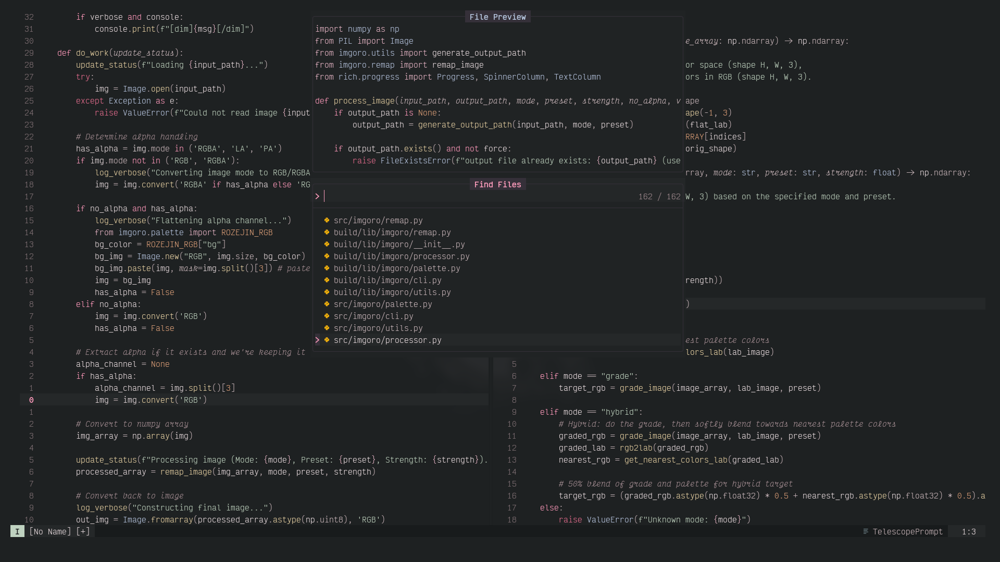

<div align="center">

# rozejin


Inspired by Goku Black’s Super Saiyan Rosé form, this theme evokes a lethal elegance that balances ashen, silent shadows against the sharp, arrogant radiance of a cold pink aura.

## Summary
</div>



## Features

- Tree-sitter highlight coverage
- LSP and diagnostic groups

## Installation

Example with `lazy.nvim`:

```lua
{
  "tuffgniuz/rozejin.nvim",
  config = function()
    require("rozejin").setup({
      transparent = true,
    })
    vim.cmd.colorscheme("rozejin")
  end,
}
```

## Usage

```vim
:colorscheme rozejin
```

Or:

```vim
:Rozejin
```

Transparent background is enabled by default. To force opaque backgrounds:

```lua
require("rozejin").setup({
  transparent = false,
})
```

## Lualine

Use the bundled lualine theme:

```lua
require("lualine").setup({
  options = {
    theme = require("rozejin.lualine"),
  },
})
```

It also works with lualine's theme lookup:

```lua
require("lualine").setup({
  options = {
    theme = "rozejin",
  },
})
```

If you use `theme = "auto"` and your active colorscheme is `rozejin`, lualine can pick it up automatically.

## Ports

Rozejin isn't just for Neovim! This repository also includes ports for your favorite applications. You can find them in the `ports/` directory:

- **Kitty** (`ports/kitty/`)
- **Ghostty** (`ports/ghostty/`)
- **Fish Shell** (`ports/fish/`)
- **Firefox** (`ports/firefox/`)

Check the respective folders for installation instructions.
